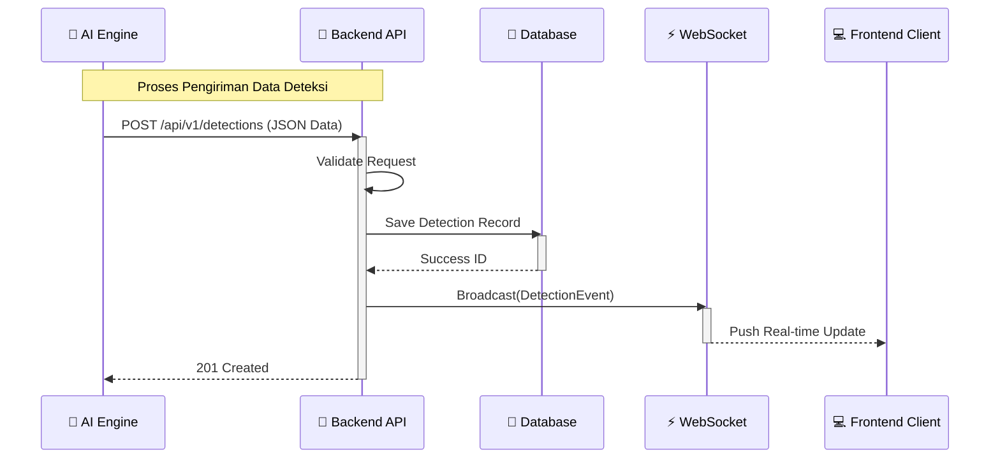
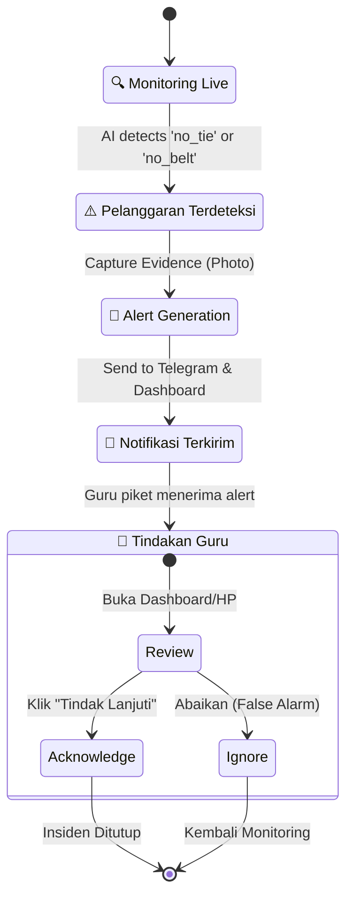
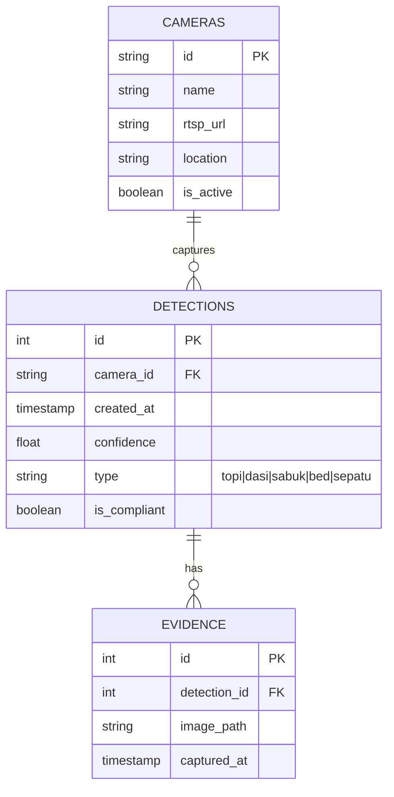

# 🗺️ SiRapi System Flowcharts

Dokumentasi ini berisi diagram alur (flowchart) lengkap yang menjelaskan cara kerja sistem internal SiRapi, mulai dari input kamera di gerbang sekolah, pemrosesan AI, hingga notifikasi ke manajemen sekolah.

---

## 🏗️ 1. High-Level System Architecture

Gambaran umum bagaimana semua komponen sistem terhubung.

```mermaid
graph TB
    subgraph "External World"
        Student[👨‍🎓 Siswa]
        Camera[📷 CCTV Gerbang]
        Admin[👤 Guru / Admin]
    end

    subgraph "SiRapi System"
        direction TB
        
        subgraph "AI Processing Unit"
            ImgCap[📸 Image Capture]
            YOLO[🤖 YOLOv8 Model]
            Logic[⚙️ Violation Logic]
        end

        subgraph "Backend Core"
            API[🌐 HTTP API (Fiber)]
            WS[⚡ WebSocket Hub]
            DB[(💾 SQLite DB)]
        end

        subgraph "Interfaces"
            Dash[🖥️ Web Dashboard]
            Tele[📱 Telegram Bot]
        end
    end

    Student -- "Berjalan Masuk" --> Camera
    Camera -- "RTSP Stream" --> ImgCap
    ImgCap -- "Frames" --> YOLO
    YOLO -- "Detections" --> Logic
    Logic -- "POST /detections" --> API
    Logic -- "Send Photo" --> Tele
    
    API -- "Broadcast" --> WS
    API -- "Store" --> DB
    
    WS -- "Live Data" --> Dash
    Tele -- "Alert Message" --> Admin
    Dash -- "Monitoring" --> Admin
```

---

## 🤖 2. Alur Proses AI Engine (Python)

Detail bagaimana sistem melakukan deteksi dan menentukan pelanggaran seragam sekolah.

```mermaid
flowchart TD
    Start([🚀 Start AI Engine]) --> Init[Load Config & YOLOv8 Model]
    Init --> ConnectCam{Connect Camera?}
    
    ConnectCam -- No --> Error[❌ Log Error & Retry]
    ConnectCam -- Yes --> Loop[🔄 Frame Loop]
    
    Loop --> Capture[📸 Capture Frame]
    Capture --> Infer[🔍 Run YOLOv8 Inference]
    Infer --> Filter[🧹 Filter Low Confidence < 0.5]
    
    Filter --> Classify{Check Classes}
    
    Classify -- "Tanpa Dasi/Topi/Sabuk" --> Violation[⚠️ Pelanggaran Terdeteksi]
    Classify -- "Atribut Lengkap" --> Compliance[✅ Patuh]
    
    Violation --> Draw[✏️ Draw Red Box & Label]
    Compliance --> DrawGreen[✏️ Draw Green Box]
    
    Draw --> Payload[📦 Prepare JSON Payload]
    DrawGreen --> Payload
    
    Payload --> SendAPI{Send to Backend?}
    
    SendAPI -- Yes --> POST[🌐 HTTP POST /api/v1/detections]
    
    Violation --> TeleCheck{Telegram Enabled?}
    TeleCheck -- Yes --> SendTele[📱 Send Photo to Telegram]
    TeleCheck -- No --> Continue
    
    POST --> Display[📺 Show Window (Optional)]
    SendTele --> Display
    Continue --> Display
    
    Display --> Loop
```

---

## 🔧 3. Alur Data Backend (Golang)

Bagaimana backend menerima data deteksi pelanggaran seragam dan menyebarkannya.



---

## 📱 4. Alur Notifikasi & Tindakan

Bagaimana sistem menangani insiden pelanggaran kedisiplinan.



---

## 💾 5. Struktur Data (ER Diagram)

Skema database sederhana yang digunakan.


