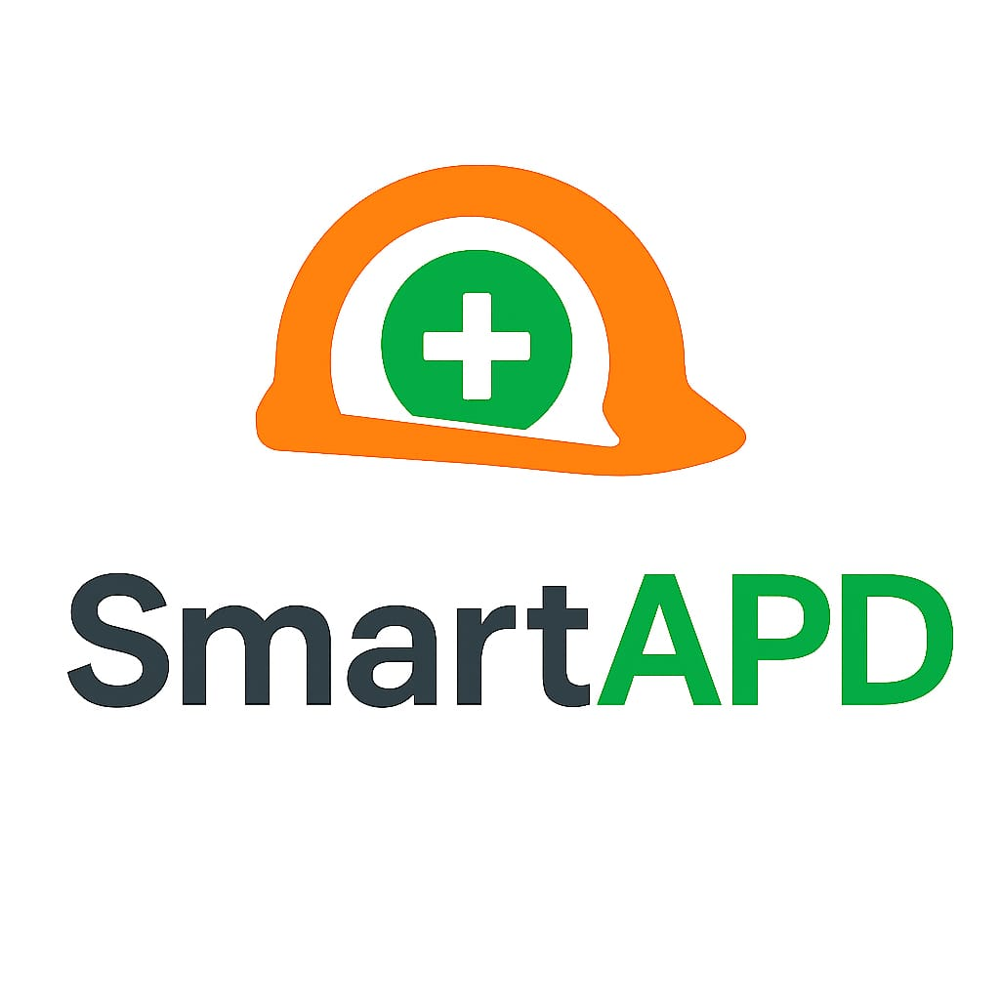

# 🦺 SmartAPD - AI-Powered PPE Detection System

<div align="center">



**Sistem Pemantauan Kepatuhan APD (Alat Pelindung Diri) Berbasis AI**

[](https://nextjs.org/)
[](https://golang.org/)
[](https://python.org/)
[](https://ultralytics.com/)

[Demo](#-demo) • [Instalasi](#-instalasi) • [Dokumentasi](#-dokumentasi) • [API](#-api-endpoints)

</div>

---

## 🎯 Tentang SmartAPD

**SmartAPD** adalah sistem pemantauan keselamatan kerja berbasis AI yang mendeteksi penggunaan Alat Pelindung Diri (APD) secara real-time. Sistem ini dirancang untuk industri konstruksi, manufaktur, dan pertambangan.

### ✨ Fitur Utama

| Fitur | Deskripsi |
|-------|-----------|
| 🤖 **AI Detection** | Deteksi helm, rompi, sarung tangan, sepatu dalam < 2 detik |
| 📡 **Real-time Monitoring** | Pantau live dari webcam atau IP Camera (RTSP) |
| 🔔 **Telegram Alerts** | Notifikasi instan saat pelanggaran terdeteksi |
| 📊 **Dashboard Analytics** | Statistik kepatuhan harian, mingguan, bulanan |
| 📹 **Multi-Camera** | Support hingga 50+ kamera simultan |
| 💾 **Auto Reports** | Laporan otomatis jam 18:00 setiap hari |
| 🔒 **Edge Computing** | Semua proses lokal, data tetap aman |

---

## 🏗️ Arsitektur Sistem

```
┌─────────────────────────────────────────────────────────────────┐
│                     SMARTAPD ARCHITECTURE                       │
├─────────────────────────────────────────────────────────────────┤
│                                                                 │
│   📷 CCTV/Webcam                                               │
│         │                                                       │
│         ▼                                                       │
│   ┌───────────────┐    HTTP POST    ┌───────────────┐          │
│   │  🤖 AI-ENGINE │ ──────────────▶ │  🔧 BACKEND   │          │
│   │    (Python)   │                 │   (Golang)    │          │
│   │    YOLOv8     │                 │    Fiber      │          │
│   └───────────────┘                 └───────┬───────┘          │
│          │                                  │                   │
│          │ Screenshots                      │ WebSocket         │
│          ▼                                  ▼                   │
│   ┌───────────────┐                 ┌───────────────┐          │
│   │  📱 TELEGRAM  │                 │  🎨 FRONTEND  │          │
│   │    Alerts     │                 │   (Next.js)   │          │
│   └───────────────┘                 └───────────────┘          │
│                                                                 │
└─────────────────────────────────────────────────────────────────┘
```

---

## 📁 Struktur Project

```
smartapd/
├── 🤖 ai-engine/              # AI Detection Engine (Python)
│   ├── detector.py            # PPE Detector class
│   ├── detector_realtime.py   # Real-time webcam detection
│   ├── telegram_bot.py        # Telegram notifications
│   ├── config.py              # Configuration
│   ├── database.py            # Database operations
│   ├── models/                # ONNX/PyTorch models
│   └── requirements.txt       # Python dependencies
│
├── 🔧 backend/                # API Server (Golang)
│   ├── cmd/server/main.go     # Entry point
│   ├── internal/
│   │   ├── handlers/          # API handlers
│   │   ├── services/          # Business logic
│   │   ├── models/            # Database models
│   │   ├── middleware/        # Custom middleware
│   │   └── database/          # GORM + SQLite
│   └── pkg/utils/             # Utilities
│
├── 🎨 frontend/               # Dashboard (Next.js)
│   ├── app/                   # App router pages
│   │   ├── page.tsx           # Landing page
│   │   ├── dashboard/         # Main dashboard
│   │   ├── alerts/            # Alerts management
│   │   └── settings/          # Settings
│   ├── components/            # React components
│   └── public/images/         # Static assets
│
├── 📚 training/               # Training data
│   ├── with_helmet/           # Positive samples
│   └── without_helmet/        # Negative samples
│
├── 📓 notebooks/              # Jupyter notebooks
│   └── 01_training_ppe_model.py
│
├── 📖 docs/                   # Documentation
├── 💾 data/                   # Database & screenshots
├── 🧪 tests/                  # Test files
├── 🖼️ assets/                 # Static assets
│
├── .env                       # Environment variables
├── .env.example               # Environment template
├── config.yaml                # System configuration
├── requirements.txt           # Root Python deps
└── README.md                  # This file
```

---

## 🚀 Instalasi

### Prerequisites

| Requirement | Version | Note |
|-------------|---------|------|
| Python | 3.10+ | Untuk AI Engine |
| Go | 1.21+ | Untuk Backend |
| Node.js | 18+ | Untuk Frontend |
| Git | Latest | Version control |

### 1. Clone Repository

```bash
git clone https://github.com/yourusername/smartapd.git
cd smartapd
```

### 2. Setup Environment

```bash
# Copy environment template
cp .env.example .env

# Edit dengan nilai yang sesuai
# TELEGRAM_BOT_TOKEN=your_token
# TELEGRAM_CHAT_ID=your_chat_id
```

### 3. Install AI Engine

```bash
cd ai-engine
pip install -r requirements.txt
```

### 4. Install Backend

```bash
cd backend
go mod tidy
go build -o smartapd-backend.exe ./cmd/server/
```

### 5. Install Frontend

```bash
cd frontend
npm install
```

---

## ▶️ Menjalankan Aplikasi

### Option A: Development Mode (Terpisah)

**Terminal 1 - Backend:**
```bash
cd backend
./smartapd-backend.exe
# atau: go run cmd/server/main.go
```

**Terminal 2 - Frontend:**
```bash
cd frontend
npm run dev
```

**Terminal 3 - AI Engine:**
```bash
cd ai-engine
python detector_realtime.py --camera 0
```

### Option B: Quick Start Script

```bash
# Coming soon: docker-compose up
```

### 🌐 Akses Aplikasi

| Service | URL |
|---------|-----|
| Frontend | http://localhost:3000 |
| Backend API | http://localhost:8080 |
| API Health | http://localhost:8080/health |
| WebSocket | ws://localhost:8080/ws |

---

## 📡 API Endpoints

### Health Check
```http
GET /health
```

### Detections
```http
GET    /api/v1/detections          # List semua deteksi
GET    /api/v1/detections/:id      # Detail deteksi
POST   /api/v1/detections          # Tambah deteksi baru
GET    /api/v1/detections/stats    # Statistik deteksi
```

### Alerts
```http
GET    /api/v1/alerts              # List semua alert
POST   /api/v1/alerts              # Buat alert baru
PUT    /api/v1/alerts/:id/acknowledge  # Acknowledge alert
```

### Cameras
```http
GET    /api/v1/cameras             # List kamera
GET    /api/v1/cameras/:id         # Detail kamera
POST   /api/v1/cameras             # Tambah kamera
PUT    /api/v1/cameras/:id         # Update kamera
DELETE /api/v1/cameras/:id         # Hapus kamera
```

### Reports
```http
GET    /api/v1/reports/daily       # Laporan harian
GET    /api/v1/reports/weekly      # Laporan mingguan
GET    /api/v1/reports/export      # Export laporan
```

### WebSocket
```http
WS     /ws                         # Real-time updates
```

---

## 🎯 Kelas Deteksi

| ID | Kelas | Status | Deskripsi |
|----|-------|--------|-----------|
| 0 | `helmet` | ✅ Patuh | Memakai helm safety |
| 1 | `no_helmet` | ⚠️ Pelanggaran | Tidak memakai helm |
| 2 | `vest` | ✅ Patuh | Memakai rompi safety |
| 3 | `no_vest` | ⚠️ Pelanggaran | Tidak memakai rompi |
| 4 | `gloves` | ✅ Patuh | Memakai sarung tangan |
| 5 | `no_gloves` | ⚠️ Pelanggaran | Tidak memakai sarung tangan |
| 6 | `boots` | ✅ Patuh | Memakai sepatu safety |
| 7 | `no_boots` | ⚠️ Pelanggaran | Tidak memakai sepatu safety |
| 8 | `person` | ℹ️ Info | Orang terdeteksi |

---

## ⚙️ Konfigurasi

### Environment Variables (.env)

```env
# Backend
PORT=8080
DATABASE_URL=./data/detections.db

# Telegram
TELEGRAM_BOT_TOKEN=your_bot_token_here
TELEGRAM_CHAT_ID=your_chat_id_here

# AI Engine
CONFIDENCE_THRESHOLD=0.5
DETECTION_INTERVAL=0.5
```

### config.yaml

```yaml
model:
  weights: "ai-engine/models/ppe_detector.onnx"
  confidence: 0.5
  iou_threshold: 0.45

camera:
  source: 0
  fps: 30
  resolution: [1280, 720]

telegram:
  enabled: true
  cooldown: 60

database:
  path: "data/detections.db"
  save_images: true
```

---

## 📱 Telegram Bot Setup

1. **Buat Bot**
   - Buka Telegram, cari @BotFather
   - Kirim `/newbot`
   - Ikuti instruksi, simpan **Bot Token**

2. **Dapatkan Chat ID**
   - Kirim pesan ke bot Anda
   - Buka: `https://api.telegram.org/bot<TOKEN>/getUpdates`
   - Cari value `chat.id`

3. **Konfigurasi**
   - Masukkan token dan chat ID ke file `.env`

---

## 🛠️ Tech Stack

| Layer | Technology |
|-------|------------|
| **AI Engine** | Python, YOLOv8, OpenCV, ONNX Runtime |
| **Backend** | Go 1.21, Fiber, GORM, SQLite |
| **Frontend** | Next.js 14, React 18, TailwindCSS, Framer Motion |
| **Database** | SQLite (bisa upgrade ke PostgreSQL) |
| **Notifications** | Telegram Bot API |
| **Real-time** | WebSocket |

---

## 🧪 Testing

### Backend Test
```bash
cd backend
go test ./...
```

### Frontend Build Test
```bash
cd frontend
npm run build
```

### AI Engine Test
```bash
cd ai-engine
python -c "from detector_realtime import PPEDetector; print('OK')"
```

---

## 📊 Performance

| Metric | Value |
|--------|-------|
| Inference Speed | 5-10 FPS (CPU), 30+ FPS (GPU) |
| Model Size | ~20 MB (ONNX) |
| API Response | < 50ms |
| WebSocket Latency | < 100ms |

---

## 📚 Dokumentasi Lengkap

| Dokumen | Lokasi |
|---------|--------|
| Training Guide | `notebooks/01_training_ppe_model.py` |
| AI Engine README | `ai-engine/README.md` |
| Backend README | `backend/README.md` |
| Design Concept | `docs/FRONTEND_DESIGN_CONCEPT.md` |
| Training Docs | `docs/TRAINING_DOCUMENTATION_TEMPLATE.md` |
| AI Prompts | `docs/AI_IMAGE_PROMPTS.md` |

---

## 🤝 Kontribusi

Kontribusi sangat diterima! Silakan buat Pull Request.

---

## 📄 License

MIT License - lihat file [LICENSE](LICENSE)

---

## 👨‍💻 Author

**SmartAPD Team**

Developed by [@syarfddn_yhya](https://instagram.com/syarfddn_yhya)

📞 Contact: [WhatsApp](https://wa.me/6282330919114)

---

## 🙏 Acknowledgments

- Ultralytics untuk YOLOv8
- Roboflow untuk dataset tools
- Fiber team untuk Go framework
- Next.js team untuk React framework

---

<div align="center">

**⚠️ Disclaimer**: Sistem ini dirancang sebagai alat bantu dan tidak menggantikan pengawasan manusia dalam skenario keselamatan kritis.

---

Made with ❤️ for workplace safety

</div>