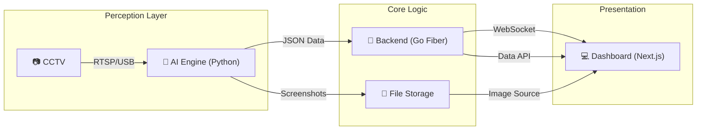

# 🛡️ SmartAPD - Next Gen AI Safety Monitoring

<div align="center">


### **Sistem Pemantauan K3 & Kepatuhan APD Berbasis Computer Vision**

*Enterprise Grade Safety Solution for Construction & Manufacturing*

[](https://nextjs.org/)
[](https://gofiber.io/)
[](https://ultralytics.com/)
[](LICENSE)

<br/>

**[📖 Dokumentasi](#-dokumentasi)** • **[📸 Galeri](#-galeri-sistem)** • **[🚀 Instalasi](#-instalasi)** • **[📡 API](#-api-endpoints)**

</div>

---

## 🔄 Alur Kerja Sistem (Workflow)

```mermaid
sequenceDiagram
    participant Worker as 👷 Worker
    participant CCTV as 📷 CCTV
    participant AI as 🧠 AI Engine
    participant Backend as 🚀 Server
    participant DB as 💾 Database
    participant Dashboard as 💻 Admin UI
    participant TG as 📱 Telegram Bot

    Worker->>CCTV: Masuk Area Kerja
    CCTV->>AI: Streaming Video (RTSP)
    
    rect rgb(20, 20, 20)
        Note over AI: Deteksi APD (YOLOv8)
        AI->>AI: Cek Helm, Rompi, Sepatu
    end

    alt Pelanggaran Terdeteksi
        AI->>Backend: Kirim Data Pelanggaran + Foto
        Backend->>DB: Simpan Record
        Backend->>Dashboard: Alert WebSocket (Real-time)
        Backend->>TG: Kirim Notifikasi & Bukti Foto
    else Patuh APD
        AI->>Backend: Kirim Data Kepatuhan
        Backend->>DB: Log Kepatuhan
    end
```



---

## 🎯 Tentang SmartAPD

**SmartAPD** adalah platform keselamatan kerja cerdas yang menggabungkan kekuatan **Artificial Intelligence** dan **IoT**. Sistem ini bekerja 24/7 mendeteksi kelengkapan Alat Pelindung Diri (APD) pekerja secara otomatis melalui kamera CCTV yang sudah ada.

> 💡 **"Safety First" bukan sekadar slogan.** SmartAPD mentransformasi pengawasan manual menjadi sistem digital yang proaktif, mencegah kecelakaan kerja sebelum terjadi.

### Key Capabilities

* ✅ **Deteksi Presisi:** Mengidentifikasi Helm, Rompi, Sepatu, Kacamata, dan Sarung Tangan.
* ✅ **0% Downtime:** Arsitektur Microservices yang tahan banting (Fault Tolerant).
* ✅ **Evidence Based:** Setiap pelanggaran direkam dengan foto bukti (Snapshot) dan Timestamp valid.

---

## ✨ Fitur Unggulan V2.0

### 1. 🧠 High-Performance AI Engine

* **Model:** YOLOv8 Custom Fine-tuned (Akurasi > 90%).
* **Speed:** Pemrosesan < 80ms per frame (Real-time).
* **Adaptif:** Otomatis menyesuaikan pencahayaan (Brightness/Contrast Enhancer).
* **Smart Rewind:** Fitur otomatis rewind untuk video demo/testing.

### 2. ⚡ Backend & Infrastructure

* **Go Fiber:** REST API super cepat dengan Go Routines.
* **WebSocket Hub:** Streaming data deteksi tanpa delay (Low Latency).
* **Auto Maintenance:** Sistem otomatis menghapus data sampah (> 7 hari) untuk menghemat storage.

### 3. 📱 Dashboard & Reporting

* **Live Center:** Tampilan grid kamera dinamis (Smart Grid) dengan status koneksi.
* **PDF Reports Pro:** Laporan pelanggaran lengkap dengan **Foto Bukti Tertanam**, grafik, dan breakdown lokasi.
* **Cross Platform:** Responsif di Desktop, Tablet, dan Mobile.

---

## 🏗️ Arsitektur Teknologi

Sistem dibangun dengan prinsip **Clean Architecture** dan **Microservices**:



### Folder Structure

```bash
smartapd/
├── 🤖 ai-engine/             # Python + YOLOv8 + OpenCV
├── 🔧 backend/               # Go (Golang) + GORM + Fiber
├── 🎨 frontend/              # Next.js 14 + Tailwind + Shadcn/UI
├── 📚 data/                  # SQLite DB & Screenshots storage
└── 📜 start-all-external.bat # One-click Startup Script
```

---

## 🚀 Instalasi & Quick Start

Sistem ini didesain "Plug & Play" untuk Windows.

### Persyaratan

* Python 3.10+
* Go 1.22+
* Node.js 18+

### Cara Menjalankan (Satu Klik)

Cukup jalankan script launcher:

```powershell
./start-all-external.bat
```

Script ini akan otomatis:

1. Membuka 3 Terminal terpisah (AI, Backend, Frontend).
2. Menjalankan migrasi database jika perlu.
3. Membuka Dashboard di browser default.

---

## 👨‍💻 Tim Pengembang

Project ini dikembangkan dengan dedikasi tinggi untuk kemajuan K3 di Indonesia.

<div align="center">


**SmartAPD Team - Safety Tech Division**

**Lead Developer:** [@syarfddn_yhya](https://instagram.com/syarfddn_yhya)
**Role:** Fullstack AI Engineer
**Contact:** [WhatsApp](https://wa.me/6282330919114) | [Email](mailto:developer@smartapd.id)

</div>

---

## 📄 Lisensi

Copyright © 2025 SmartAPD. All Rights Reserved.
Dilisensikan di bawah **MIT License**.

<div align="center">
<i>"Keselamatan adalah kunci produktivitas masa depan."</i>
</div>
