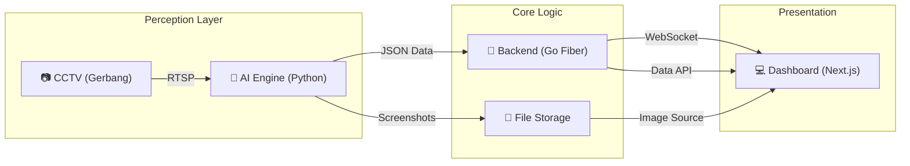

# 🛡️ SiRapi - Sistem Deteksi Seragam Berbasis Computer Vision

<div align="center">


### **Sistem Monitoring Kedisiplinan Atribut Seragam Berbasis AI**

*Mewujudkan Sustainable City di Wilayah Jombang*

[](https://nextjs.org/)
[](https://gofiber.io/)
[](https://ultralytics.com/)
[](LICENSE)

<br/>

**[📖 Dokumentasi](#-dokumentasi)** • **[📸 Galeri](#-galeri-sistem)** • **[🚀 Instalasi](#-instalasi)** • **[📡 API](#-api-endpoints)**

</div>

---

## 🔄 Alur Kerja Sistem (Workflow)

```mermaid
sequenceDiagram
    participant Student as 👨‍🎓 Siswa
    participant CCTV as 📷 CCTV
    participant AI as 🧠 AI Engine
    participant Backend as 🚀 Server
    participant DB as 💾 Database
    participant Dashboard as 💻 Admin UI
    participant TG as 📱 Telegram Bot

    Student->>CCTV: Melewati Gerbang Sekolah
    CCTV->>AI: Streaming Video (RTSP)
    
    rect rgb(20, 20, 20)
        Note over AI: Deteksi Atribut Seragam (YOLOv8)
        AI->>AI: Cek Dasi, Topi, Sabuk, Bed, Sepatu
    end

    alt Pelanggaran Terdeteksi
        AI->>Backend: Kirim Data Pelanggaran + Foto
        Backend->>DB: Simpan Record
        Backend->>Dashboard: Alert WebSocket (Real-time)
        Backend->>TG: Kirim Notifikasi & Bukti Foto
    else Atribut Lengkap
        AI->>Backend: Kirim Data Kepatuhan
        Backend->>DB: Log Kepatuhan
    end
```



---

## 🎯 Tentang SiRapi

**SiRapi** (Sistem Deteksi Kerapihan Berbasis AI) adalah inovasi teknologi berbasis Computer Vision yang dirancang untuk mengatasi tantangan pengawasan kedisiplinan atribut seragam di sekolah, khususnya SMAN Ngoro Jombang. Sistem ini mengintegrasikan AI dan CCTV untuk mendeteksi kelengkapan seragam secara otomatis dan real-time.

> 💡 **"Membangun Smart People, Menuju Smart City."** SiRapi mengubah pengawasan manual menjadi objektif dan berbasis data (automation-based), membebaskan guru piket untuk lebih fokus pada pembinaan karakter.

### Key Capabilities

* ✅ **Deteksi Presisi Tinggi:** Mengidentifikasi kelengkapan Dasi, Topi, Sabuk, Bed Kelas, dan warna Sepatu secara akurat dalam waktu singkat.
* ✅ **Penanganan Arus Padat:** Mampu memantau 25 siswa per menit saat jam kedatangan (06.30 - 07.00 WIB).
* ✅ **Evidence Based:** Setiap ketidaklengkapan dicatat beserta foto bukti (Snapshot) dan Timestamp valid.

---

## ✨ Fitur Unggulan

### 1. 🧠 High-Performance AI Engine

* **Model:** Rekayasa Deep Learning (YOLOv8) untuk pendeteksian atribut sekolah.
* **Speed:** Pemrosesan Real-time menyesuaikan kemampuan perangkat keras.
* **Smart Eye:** "Mata Digital" yang mampu memindai banyak siswa secara bersamaan.

### 2. ⚡ Backend & Infrastructure

* **Go Fiber:** REST API super cepat.
* **WebSocket Hub:** Streaming data deteksi secara real-time ke Dashboard.
* **Otomasi Laporan:** Menyediakan data statistik objektif sebagai dasar pengambilan kebijakan sekolah.

### 3. 📱 Dashboard & Reporting

* **Live Center:** Tampilan grid kamera gerbang dengan status koneksi.
* **Laporan Kepatuhan PDF:** Laporan data kedisiplinan lengkap dengan statistik dan foto pelanggaran.
* **Cross Platform:** Responsif digunakan oleh manajemen sekolah di Desktop, Tablet, dan Mobile.

---

## 🏗️ Arsitektur Teknologi

Sistem dibangun dengan prinsip **Clean Architecture** dan **Microservices**:



### Folder Structure

```bash
sirapi/
├── 🤖 ai-engine/             # Python + YOLOv8 + OpenCV
├── 🔧 backend/               # Go Server (REST API / WebSocket)
├── 🎨 frontend/              # Next.js 14 Dashboard
├── 📚 data/                  # SQLite DB & penyimpanan foto
└── 📜 start-all-external.bat # Script Menjalankan Semua Komponen
```

---

## 🚀 Instalasi & Quick Start

Sistem ini didesain agar mudah dijalankan pada lingkungan Windows.

### Persyaratan

* Python 3.10+
* Go 1.22+
* Node.js 18+

### Cara Menjalankan (Satu Klik)

Jalankan script launcher:

```powershell
./start-all-external.bat
```

Script ini akan:

1. Membuka 3 Terminal terpisah.
2. Memuat environment database.
3. Membuka Dashboard di Edge/Chrome.

---

## 👨‍💻 Tim Pengembang

Proyek ini dibuat untuk **YOUNG CHANGE-MAKER SUMMIT 2026** (Innovative Technology for Sustainability).

**Tim Peneliti:**

1. Muhammad Syarifuddin Yahya
2. Nurjanah Favela Asma'ul Qhusna
3. Gendis Hasnaa' Muflih

**Pembimbing:** Rohma Wati, S.Pd., Gr.
**Asal Sekolah:** SMAN Ngoro Jombang

---

## 📄 Lisensi

Copyright © 2026 SiRapi Team. All Rights Reserved.
Dilisensikan di bawah **MIT License**.
